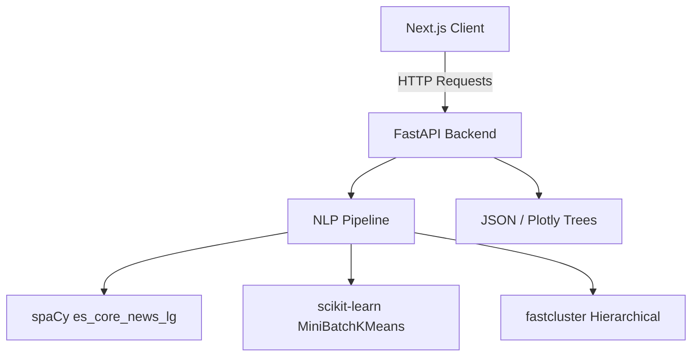

# Applied NLP Engine

A powerful NLP system for Spanish text processing with clustering visualization built with FastAPI and Next.js.


## Overview

Applied NLP Engine is a production-ready NLP system designed for processing, analyzing, and visualizing Spanish text data. It combines classical similarity algorithms with modern semantic embeddings and hierarchical clustering to extract meaningful insights from large text corpora.

### Key Features

- **Text Similarity Algorithms**: Cosine Distance and Jaccard Similarity for comparing documents
- **Semantic Embeddings**: State-of-the-art Spanish language models (spaCy es_core_news_lg/md)
- **Scalable Clustering**: MiniBatchKMeans pre-clustering for 200k+ documents
- **Hierarchical Clustering**: Dendrogram visualization with average linkage
- **Interactive Visualizations**: Plotly.js-powered charts for exploring clusters
- **RESTful API**: Clean FastAPI endpoints ready for frontend integration

## Tech Stack

### Backend
| Technology | Purpose |
|------------|---------|
| FastAPI | High-performance async API framework |
| spaCy | Spanish NLP and semantic embeddings |
| scikit-learn | MiniBatchKMeans clustering |
| SciPy | Hierarchical clustering algorithms |
| fastcluster | Optimized clustering computation |
| Pandas | Data processing |

### Frontend
| Technology | Purpose |
|------------|---------|
| Next.js 16 | Modern React framework |
| React 19 | UI components |
| Plotly.js | Interactive dendrogram visualization |
| Tailwind CSS 4 | Styling |

## Getting Started

### Prerequisites

- Docker and Docker Compose
- Or: Python 3.13+, Node.js 18+, pnpm, uv

### Running the Project (Recommended - Docker)

The easiest way to run the full stack is using Docker Compose:

```bash
# Clone the repository
git clone https://github.com/elisbanpaco/applied-nlp-engine.git
cd applied-nlp-engine

# Build and start all services
docker-compose up --build
```

Access the API docs at `http://localhost:8000/docs` and the frontend at `http://localhost:3000`.

### Running Locally (Manual Setup)

```bash
# Backend setup (uv recommended)
cd api
uv sync

# Download Spanish models
python -m spacy download es_core_news_lg

# Terminal 1: Start backend
uvicorn main:app --reload --port 8000

# Frontend setup
cd ../client
pnpm install

# Terminal 2: Start frontend
pnpm dev
```

Access the API docs at `http://localhost:8000/docs` and the frontend at `http://localhost:3000`.

## Project Structure

```
applied-nlp-engine/
├── api/                          # FastAPI backend
│   ├── core/                     # NLP algorithms
│   │   ├── distancia_coseno.py         # Cosine similarity (2 texts)
│   │   ├── distancia_coseno_with_dataset.py  # Clustering pipeline
│   │   ├── jaccard.py                   # Jaccard similarity (2 texts)
│   │   └── jaccard_with_dataset.py       # Jaccard clustering pipeline
│   ├── routes/                   # API endpoints
│   │   ├── algoritmos.py
│   │   └── route_algorithm_with_dataset.py
│   ├── schemas/                  # Pydantic models
│   │   └── data_models.py
│   ├── data/                    # Dataset (250k comments)
│   │   └── REP_COMENTARIO2.csv
│   ├── main.py                  # Application entry
│   └── pyproject.toml          # uv/dependencies config
│
├── client/                       # Next.js frontend
│   ├── src/
│   │   └── app/
│   │       ├── page.tsx              # Landing page
│   │       ├── lexicalmatcher/       # Text comparison tool
│   │       └── dendrograma/         # Clustering visualization
│   ├── components/
│   │   ├── Navbar.tsx
│   │   └── Footer.tsx
│   ├── package.json
│   ├── next.config.ts
│   └── postcss.config.mjs
│
├── LICENSE
├── AGENTS.md
└── README.md
```

## API Endpoints

### Text Similarity (1-vs-1)
| Endpoint | Method | Description |
|----------|--------|-------------|
| `/api/v1/algoritmos/comparar-textos-distancia-coseno` | POST | Calculate cosine similarity between two texts |
| `/api/v1/algoritmos/comparar-textos-jaccard` | POST | Calculate Jaccard similarity between two texts |

### Clustering
| Endpoint | Method | Description |
|----------|--------|-------------|
| `/api/v1/clustering/distancia-coseno` | GET | Generate dendrogram with cosine similarity |
| `/api/v1/clustering/jaccard` | GET | Generate dendrogram with Jaccard index |

### Example Requests

```bash
# Cosine similarity
curl -X POST "http://localhost:8000/api/v1/algoritmos/comparar-textos-distancia-coseno" \
  -H "Content-Type: application/json" \
  -d '{"textoA": "El servicio es excelente", "textoB": "Muy buen servicio"}'

# Jaccard similarity
curl -X POST "http://localhost:8000/api/v1/algoritmos/comparar-textos-jaccard" \
  -H "Content-Type: application/json" \
  -d '{"textoA": "El servicio es excelente", "textoB": "Muy buen servicio"}'

# Get dendrogram
curl "http://localhost:8000/api/v1/clustering/distancia-coseno"
```

## How It Works

### Similarity Algorithms

**Cosine Similarity**: Uses spaCy semantic embeddings (300-dim vectors) to compute document similarity based on vector angle.

**Jaccard Similarity**: Compares word sets between documents using tokenization and lemmatization.

### Clustering Pipeline

1. **Text Vectorization**: Documents are converted to semantic vectors using spaCy `es_core_news_lg` (Cosine) or binary Bag-of-Words (Jaccard).
2. **Pre-clustering**: `MiniBatchKMeans` reduces the corpus ($N \approx 38,109$ unique documents) to $k = 127$ macro-representatives. For Cosine clustering, vectors are **L2-normalized** beforehand to align with the angular metric (Spherical K-Means). For Jaccard clustering, representatives are selected using **Medoid Projection** (extracting the closest real document vector per cluster) to prevent empty vectors.
3. **Hierarchical Clustering**: A dendrogram is built using fastcluster's average linkage based on cosine or Jaccard distances of the representatives.
4. **Visualization**: Interactive tree visualization in the frontend with Plotly.js.

### Why This Approach?

- **Mathematical Rigor**: Spherical K-Means (L2 normalized) and Medoid Projection prevent metric distortion and avoid empty cluster vectors.
- **Scalability**: MiniBatchKMeans handles large-scale corpora efficiently by reducing density before hierarchical building.
- **Deduplication**: Eliminating duplicates cleans the data from 262k rows to 38,109 unique comments, drastically reducing computation.
- **Spanish Lemmatization**: Custom pipeline filtering (excluding stopwords, punctuation, and numbers) ensures precise lexical overlap.
- **Performance**: High-throughput `nlp.pipe()` with parallel regex anonymization optimizes CPU execution.

## Architecture



## Design Decisions & Trade-offs

- **MiniBatchKMeans over DBSCAN/HDBSCAN:** While density-based algorithms don't require an explicit `k`, they struggle with high-dimensional text embeddings. MiniBatchKMeans was chosen for its blazing fast pre-clustering speed on 250k rows, despite requiring a pre-defined macro-cluster limit.
- **Spherical K-Means:** Regular K-Means uses Euclidean distance, which breaks cosine similarities. By applying L2-normalization before clustering, we approximate Spherical K-Means, keeping the mathematical integrity of word embeddings intact.
- **Medoid Projection for Jaccard:** Jaccard similarity operates on sets, not dense vectors. By forcing the cluster centers back to the nearest real document (medoids), we guarantee that all representatives used in the final dendrogram correspond to actual user comments rather than abstract centroid averages.
- **FastAPI + Async:** While the heavy ML calculations are currently synchronous, the async framework allows for scaling up with background workers (Celery) in the future without blocking concurrent user traffic.

## Frontend Pages

| Page | Path | Description |
|------|------|-------------|
| Landing | `/` | Main landing page with futuristic design |
| Lexical Matcher | `/lexicalmatcher` | Interactive text comparison tool |
| Dendrogram | `/dendrograma` | Interactive clustering visualization |

## Contributing

Contributions are welcome! Please read our contributing guidelines before submitting PRs.

1. Fork the repository
2. Create a feature branch (`git checkout -b feature/amazing-feature`)
3. Commit your changes (`git commit -m 'Add amazing feature'`)
4. Push to the branch (`git push origin feature/amazing-feature`)
5. Open a Pull Request

## License

This project is licensed under the MIT License - see the [LICENSE](LICENSE) file for details.

## Acknowledgments

- [spaCy](https://spacy.io/) for Spanish language models
- [FastAPI](https://fastapi.tiangolo.com/) for the amazing framework
- [Plotly](https://plotly.com/) for visualization components

---

<p align="center">Built with ❤️ for the NLP community</p>